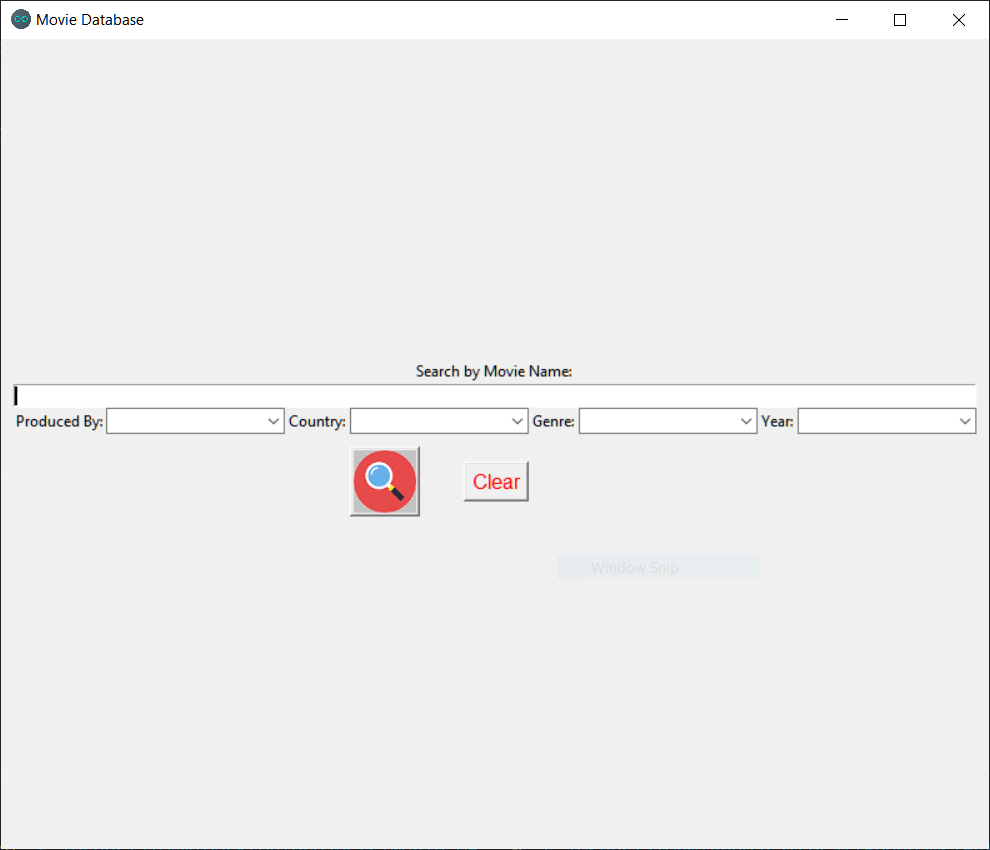

# Movie database-
   This movie dataset contains almost all the movies and their rating by imdb users released on or before July 2018  
   [source](https://www.kaggle.com/datasets/rounakbanik/the-movies-dataset)

# Running the code-
   
   Requirements : 
   
            library: tkinter, sqlite3
   RUN
   
      python movieInterface.py

# UI-

